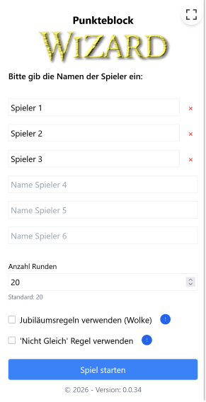
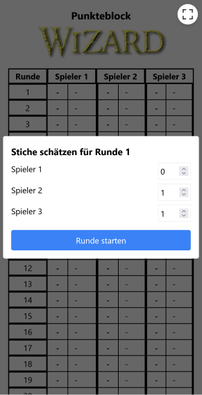
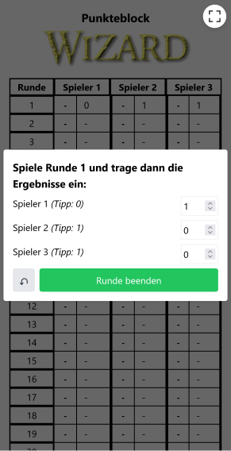
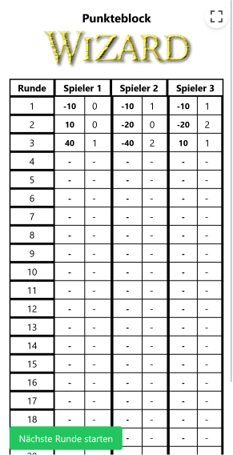

# Wizard Scoreboard

A digital scoreboard for the card game Wizard, built with Vite, React, and TypeScript.


<table>
  <tr>
    <td></td>
    <td></td>
  </tr>
  <tr>
    <td></td>
    <td></td>
  </tr>
</table>

You can see a live demo [here](https://bj-eberhardt.github.io/wizard-scorecard/).

## Features

- Easy management of players and rounds
- Clear display of scores
- Responsive design for desktop and mobile

## Development

```bash
npm install
npm run dev
```

## Production & Deployment

### Docker

The project can be built with Docker and served using nginx:

```bash
docker build -t wizard-scoreboard .
docker run -p 8080:80 wizard-scoreboard
```

It starts at `http://localhost:8080`.

You can get the image also via docker-hub via:
https://hub.docker.com/repository/docker/beberhardt/wizard-scorecard

### Webassets folder

You can also create the assets directly and serve them yourself on any web server:

```bash
npm run build
```
will build the assets in the folder "dist". You can also download the latest assets from the [releases](https://github.com/bj-eberhardt/wizard-scorecard/releases) page.